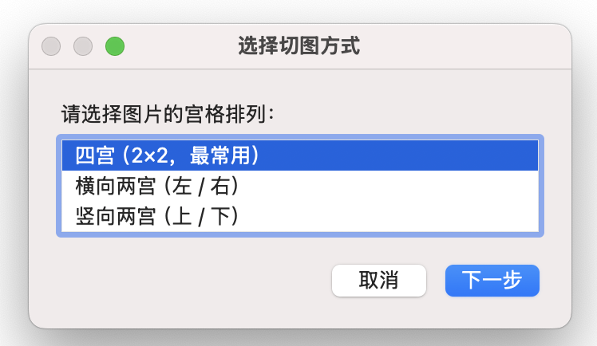
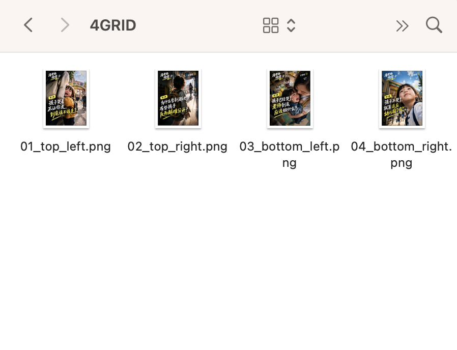

# GridSplit

[中文说明](README.zh-CN.md)

A lightweight, cross-platform Python utility for splitting 2-panel and 4-panel grid images into separate image files.

Built for a simple workflow: take a combined image, split it into individual panels, and continue editing, publishing, or organizing the results.


> **Language:** The current graphical interface is in Simplified Chinese. English interface support is planned for a future release.
> 
## Features

- Split 2-panel images vertically or horizontally
- Split 4-panel grid images
- Support PNG and JPEG images
- Handle odd image dimensions
- Generate output files automatically
- Produce a manifest for each run
- Cross-platform Python implementation
- Tested on macOS
- Designed to work on Windows and Linux with Python installed

## Example

### Input
A 2-panel or 4-panel combined image can be used as the source image.


### Select a layout
Choose the corresponding layout in the graphical interface.



### Output
GridSplit separates the source image into individual image files.



> ## Requirements

- Python 3.10 or later
- Pillow

## Installation

Clone the repository:

```bash
git clone https://github.com/mshelenzhang/GridSplit.git
cd GridSplit
